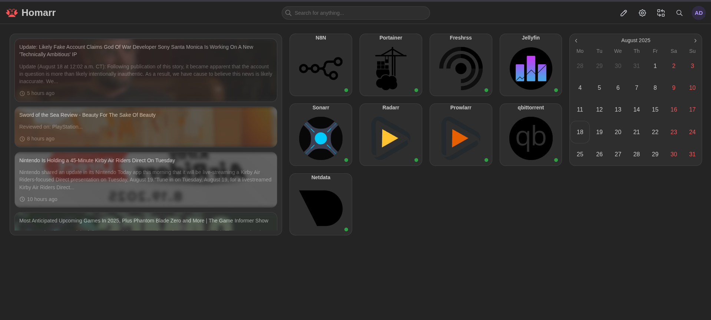

# 🏠 My Homelab Setup

This repo documents my **homelab running on Fedora 42** with **Docker**.  
The Objective was to create a self hosted homelab that was capable of running multiple services and that could serve my needs and use cases.
Each service runs in its own `docker-compose.yml` file inside its own folder.




---

## 🖥️ Hardware

My homelab is currently running on:

- **Mini PC**: BOSGAME P4 Plus
- **CPU**: AMD Ryzen 7 5825U (8C/16T, up to 4.5 GHz)
- **RAM**: 32 GB DDR4
- **Storage**: 1 TB PCIe SSD
- **Networking**: Dual 2.5G LAN, Wi-Fi 6E, Bluetooth 5.2
- **GPU**: Integrated Radeon Graphics
- **OS**: Fedora 42

---

## 🚀 Services

- **Netdata** → System monitoring
- **Portainer** → Docker container management
- **Homarr** → Dashboard for quick access
- **n8n** → Workflow automation
- **Jellyfin** → Media server
- **Radarr** → Movies
- **Sonarr** → TV shows
- **Prowlarr** → Indexer manager
- **qBittorrent** → Torrent client
- **FreshRSS** → RSS reader
- **FiveFilters Full-Text RSS** → Convert feeds to full articles

---

## 📦 How to Run
1. Install Docker & Docker Compose from https://docs.docker.com/get-started/get-docker/ ( Linux/Fedora )
2. Clone this repo:
   git clone https://github.com/CloudSecJeff/Fedora-Homelab.git
3. Navigate to a service folder (e.g. `jellyfin/`):
   `cd Fedora-Homelab/jellyfin`
4. Run:
   ```bash
   docker compose up -d
⚠️ Note: Update the `docker-compose.yml` (e.g. ports, volumes, environment variables) to match your own system before running `docker compose up -d`.
